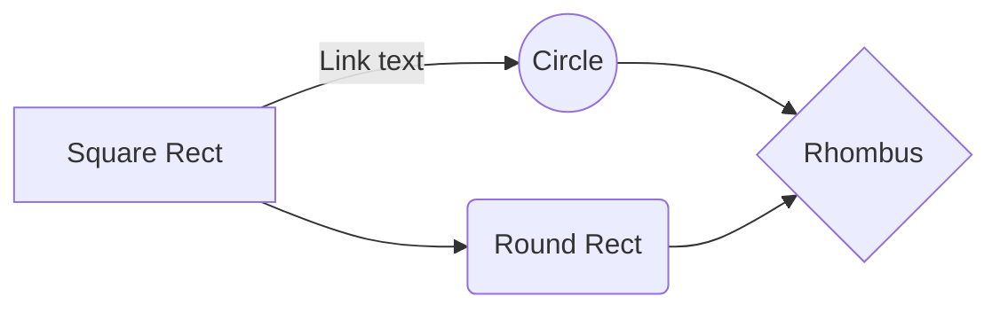

# BDD (Behavior Driven Development) Test in Django App

### Audience Level
Beginner & Mediate (Anyone who has a little experience with Django and Django Rest Framework).

### Elevator Pitch

The beauty of Behaviour-Driven Development (BDD) methodology is that it builds a tunnel between testers and business analyzers. In which, the expected behaviors of system are described in business readable and domain-specific language. 

Accordingly, testers are capable to apply tests based on the semantic of business requirements directly by following BDD workflow. Moreover, web-app needs to be tested on both Desktop and Mobile platforms so that BDD authomatic test running could save testers a lot of time from doing multiple platform tests manually.

In the end, it could be easy as well for business analyzers to understand the results of tests from steps written in Gherkin language.

### Description

As we know, unit tests focus on class and methods without database interaction and running of whole system while the integration tests focus on the component and basic business logic coverage using the part of system environment. Both of them cannot ensure that our app will work properly in production environments. Due to which, BDD tests becomes one of optimal solutions for cross-platform and feature-focused tests.

BDD is in its prevalence now and we’d like to breakdown how we implement BDD automation tests in following questions:
1. How do we collect requirements?
2. How do we design structured and reusable test code for BDD?
3. How do we speed up the running of BDD automation tests?
4. How do we integrate BDD tests with CI/CD pipeline?
5. What are the limits of BDD test?

### Notes

#### Technical Requirements

#### Background

### Tags

### Bio

